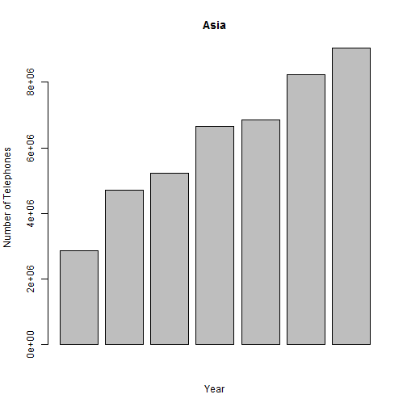

Phone in the worlds 
========================================================
author: Gal Peled 
date: 4/5/17
autosize: true

Consept 
========================================================

I was thinking it will be nice to be able to see how phones are distrebute in the world  <https://galpeled.shinyapps.io/simple_phones/>.

- we can see number of phones by year in a specific region 


- or the number of phone per region in a specific year 

num of phones in a region exemple 
========================================================


```r
library(datasets)
WorldPhones <- data.frame(WorldPhones)
barplot(WorldPhones[,3]*1000, 
            main="Asia",
            ylab="Number of Telephones",
            xlab="Year")
```



phone per region in a specific year
========================================================


sample of Ui.r code 
========================================================
```{}
library(shiny)
library(datasets)
# Define UI for application that draws a histogram
shinyUI(fluidPage(    
  
  # Give the page a title
  titlePanel("Telephones by region"),
  
  # Generate a row with a sidebar
  sidebarLayout(      
    
    # Define the sidebar with one input
    sidebarPanel(
      selectInput("region", "Region:", 
                  choices=colnames(WorldPhones)),
      hr(),
      helpText("Select a Region To see the number of Telephones there by year"),
      helpText("Data from AT&T (1961) The World's Telephones."),
      hr(),
      selectInput("year", "Year:", 
                  choices=row.names(WorldPhones)),
      hr(),
      helpText("Select a Year To see the number of Telephones in this year at each region"),
      helpText("Data from AT&T (1961) The World's Telephones.")
    ),

    # Create a spot for the barplot
    mainPanel(
      plotOutput("phonePlot"),
      plotOutput("yearPlot") 
    )
    
  )
))
```
